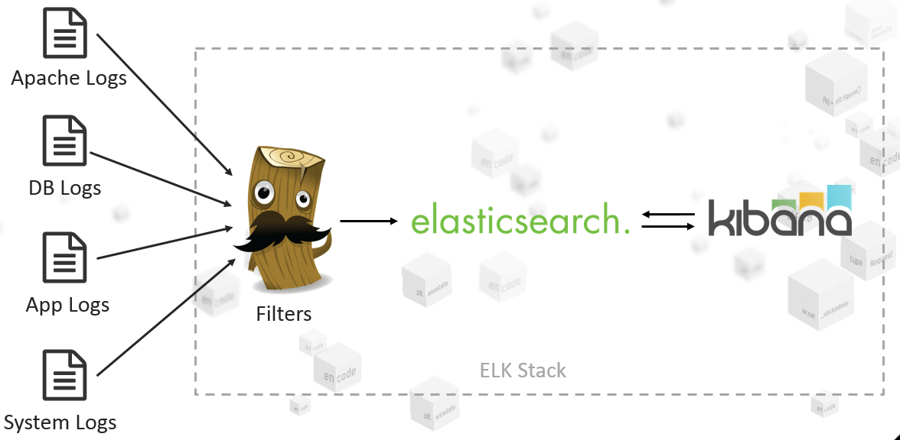
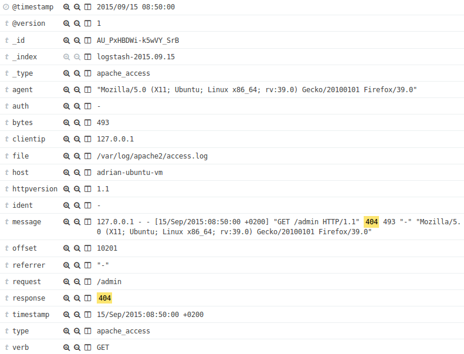
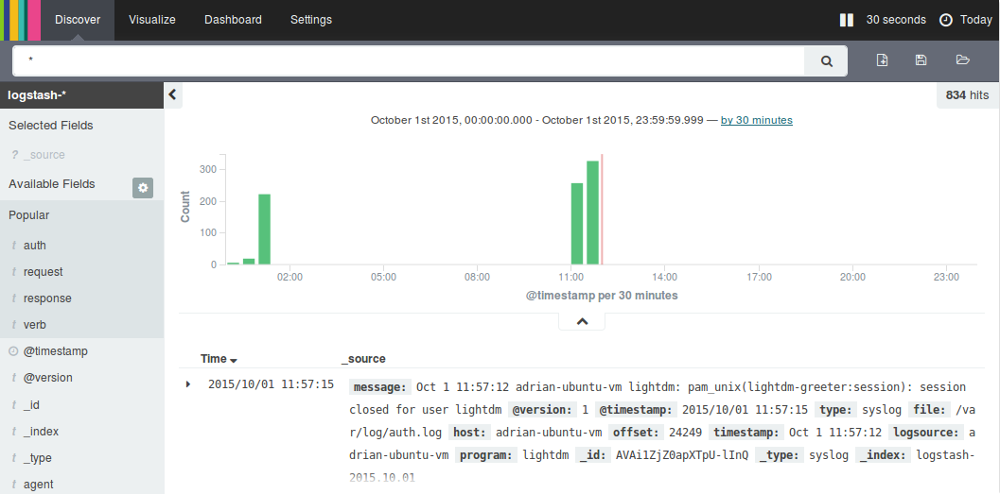
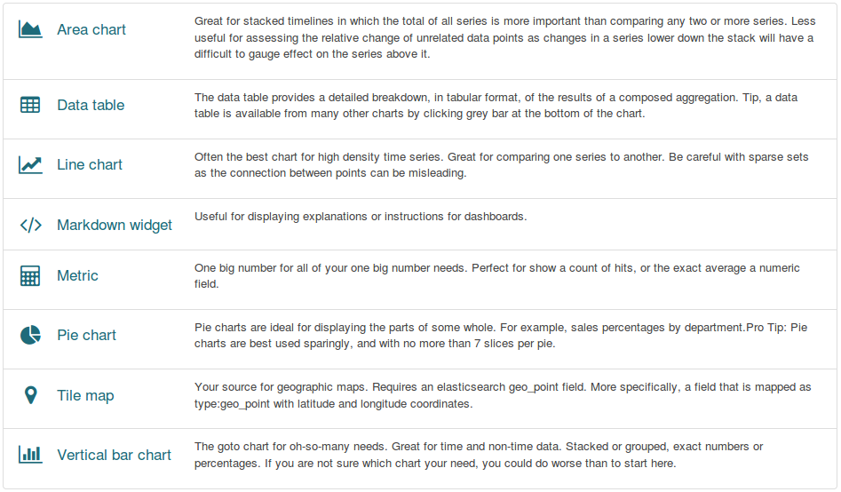
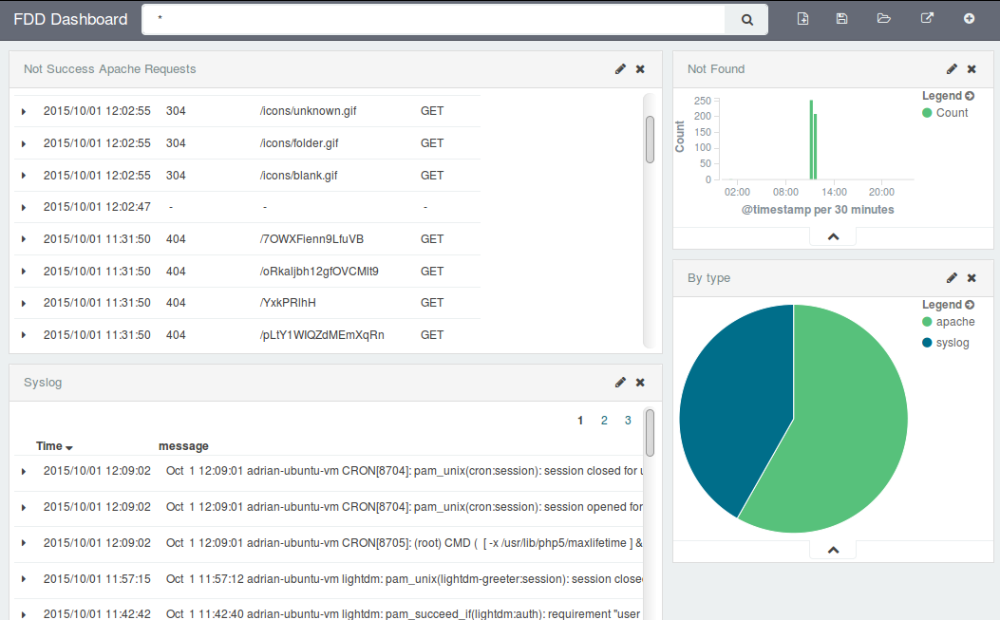
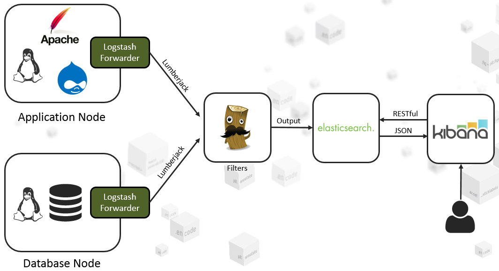
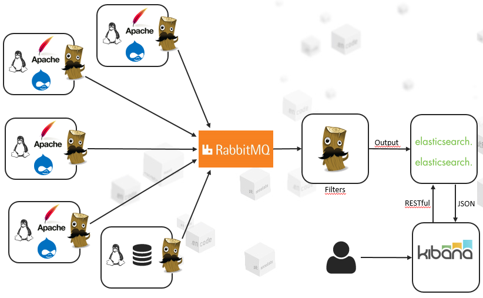

# ELK - Zapanuj Nad Logami

ELK - Elasticsearch Logstash Kibana

## Spis treœci

1) Logi

2) ELK

3) Praktyka

4) ELK a skalowalnoϾ

5) Przydatne linki

## Logi

### Czym s¹ logi? Po co je stosujemy? Problemy z logami.

> (...) zapis zawieraj¹cy informacjê o zdarzeniach i dzia³aniach dotycz¹cych systemu informatycznego, systemu komputerowego czy komputera.
>
> -- *via Wikipedia*

- umo¿liwiaj¹ analizê dzia³ania systemu, detekcjê:
   - b³êdów - sytuacji wyj¹tkowych np. logowanie informacji o wyj¹tku
   - nieprawid³owoœci dzia³ania - niezapisanie przes³anych informacji w bazie danych np. z formularza rejestracyjnego,
   - prób i sposobów w³amañ
- multum logów, w zale¿noœci od u¿ytego stacku technologicznego. Prosta web aplikacja to logi z:
   - Linux Logs (Syslog, Auth Log, FTPD Log, etc.)
   - Apache,
   - PHP,
   - MySQL (slowlog, general log, error log)
   - Application Logs.
- ciê¿ko siê je przegl¹da (Old School way : SSH -> tail, cat, grep, less, awk ...)
- du¿y rozmiar, brak spójnego formatu pomiêdzy logami - powodzenia przy analizie 100GB nieustrukturyzowanych logów
- nale¿y zadbaæ o wprowadzenie polityki archiwizacji logów
- niepotrzebne - z punktu widzenia klienta, nie przynosz¹ korzyœci biznesowej a jednak:
  - s¹...,
  - developerzy kodz¹ ```$log->warning('...');```
- nie przegl¹damy ich - kto w ci¹gu ostatniego miesi¹ca sam z siebie rzuci³ okiem na logi?

Niew¹tpliwie logi s¹ u¿ytecznym narzêdziem, jednak wykorzystywane powinny byæ z rozwag¹. Dobrym pomys³em jest implementacja funkcjonalnoœci umo¿liwiaj¹cej aktywowanie/deaktywowanie rejestracji zdarzeñ do logów (np. tylko tych z poziomem *DEBUG*).

### Poziomy logowania

Poziomy lgowania zdefiniowane przez *Syslog* (opisane w [RFC 5424](http://tools.ietf.org/html/rfc5424)):

Level | Description | Example
------|-------------|--------
Emergency | system is unusable | *Child cannot open lock file. Exiting*
Alert | action must be taken immediately | *getpwuid: couldn't determine user name from uid*
Critical | critical conditions | *socket: Failed to get a socket, exiting child*
Error | error conditions | *Premature end of script headers*
Warning | warning conditions | *child process 1234 did not exit, sending another SIGHUP*
Notice | normal but significant condition | *httpd: caught SIGBUS, attempting to dump core in ...*
Informational | informational messages | *Server seems busy, (you may need to increase StartServers, or Min/MaxSpareServers)...*
Debug | debug-level messages | *Opening config file ...*

Wykorzysytwane miêdzy innymi przez:

- standard [PSR-3](http://www.php-fig.org/psr/psr-3/) - definiuj¹cy uniwersalny interfejs loggera dla aplikacji napisanych w jêzyku PHP,
- serwer HTTP - [Apache 2](http://httpd.apache.org/docs/2.4/mod/core.html#loglevel).

### Co o logach mówi literatura?

> Logowanie jest Twoim przyjacielem. Aplikacje powinny logowaæ na poziomie *WARNING* za ka¿dym razem, kiedy przekraczany jest czas na nawi¹zywanie po³aczenia sieciowego lub czas odpowiedzi niebezpiecznie siê wyd³u¿a. Powinieneœ logowaæ na poziomie *INFO* lub, jeœli logi s¹ zbyt rozwlek³e, na poziomie *DEBUG* za ka¿dym razem, gdy zamykasz po³¹czenie. Powinieneœ logowaæ na poziomie *DEBUG* ka¿de po³¹czenie, które otwierasz, w³¹czaj¹c mo¿liwie du¿o informacji na temat punktu koñcowego po³aczenia.
>
> -- *Ci¹g³e dostarczanie oprogramowania. Automatyzacja kompilacji, testowania i wdra¿ania. Jez Humble. David Farley. Helion 2011.*

> (...)
> - instrukcje rejestracyjne pogarszaj¹ czytelnoœæ programu, utrudniaj¹c oddzielenie jego zasadniczych instrukcji od konstrukcji pomocniczych;
> - instrukcje rejestracyjne dotkniête s¹ t¹ sam¹ przypad³oœci¹, co komentarze: gdy kod aplikacji ewoluuje, programiœci zwykle zapominaj¹ o ich uaktualnieniu, co czyni je nieadekwatnymi do kontekstu, a to jest gorsze ni¿ kompletna bezu¿ytecznoœæ, bo myl¹ce;
> - niezale¿nie od tego, ile instrukcji rejestracyjnych znajdzie siê w kodzie aplikacji, zawsze bêd¹ one niewystarczaj¹ce - w przypadku kolejnego debugowania prawdopodobnie pojawi¹ siê nowe. Pozostawianie ich w kodzie sprawia, ¿e dwa poprzednie problemy staj¹ siê jeszcze bardziej wyraŸne.
>
> (...)
> Generalnie, najbardziej u¿ytecznymi wpisami w dzienniku s¹ te na najwy¿szym (strategicznym) poziomie, odzwierciedlaj¹ce typowe dla aplikacji zdarzenia - jak np. logowanie do serwera HTTP. Niskopoziomowe (taktyczne) wpisy maj¹ u¿ytecznoœæ raczej ograniczon¹ czasowo - bo np. pe³ni¹ rolê pomocn¹ w poszukiwaniu konkretnego b³êdu - i celownoœæ pozostawienia generuj¹cych je instrukcji jest co najmniej w¹tpliwa.
>
> -- *Debugowanie. Jak wyszukiwaæ i naprawiaæ b³êdy w kodzie oraz im zapobiegaæ. Paul Butcher. Helion 2009.*

## ELK

*Elasticsearch + Logstash + Kibana*

- trzy niezale¿ne od siebie open-sourceowe projekty
- vendor - firma Elastic

*ELK* wspomaga proces indeksowania plików logów (ale nie tylko) w jednym miejscu. Dziêki temu mo¿liwe jest wyszukiwanie w czasie rzeczywistym, analizowanie danych oraz przygotowywanie wizualizacji z informacji zawartych w logach. Jest szybki w du¿ych zbiorach danych, nawet takich zawieraj¹cych gigabajty informacji.



### Elasticsearch

*Indexing, storage and retrieval engine*

- serwer bazy danych i jednoczeœnie silnik wyszukiwania (full-text search*)
- bazuj¹cy na *Apache Lucene*
- real-time - szybkie indexowanie danych, dostêp danych od razu
- skalowalny, rozproszony, wysoko dostêpny
- komunikacja odbywa siê za pomoc¹ JSON + RESTful API (requesty HTTP - GET, POST, PUT, DELETE)
- brak okreœlonego schematu dla sk³adowanych dokumentów - JSON Documents

#### Terminologia

**Cluster** - grupa nodes
 
**Node** - pojedyñcza instacja *Elasticsearch*

**Index** - grupa dokumentów, powi¹zanych ze sob¹ np:

- TwitterTweets (np. per tag),
- FacebookPosts (np. per day),
- WikipediaArticles.

**Document** - odpowiednik rekordu w RDBMS, JSON ({key:value})

**Shard** - czêœæ indexu, która jest dystrybuowana pomiêdzy nodami, forma kopii zapasowej (w momencie gdy któryœ z node jest niedostêpny)

// dodaæ grafikê obrazuj¹c¹ terminologiê: https://s3.amazonaws.com/media-p.slid.es/uploads/szymontezewski/images/42225/Zrzut_ekranu_2013-07-2_o_20.47.51.png

#### Full-Text Search

- sposób przeszukiwania danych tekstowych,
- bazuje na analizie poszczególnych s³ów danej frazy w przeszukiwanym tekœcie
- zasada dzia³ania:
  - przetworzenie dokumentu tekstowego
  - utworzenie wektora s³ów zawartych w dokumencie
  - eliminacja stop-s³ów (usuwanie szumu "z, ale, od, tam")
  - lematyzacja lub stemming (sprowadzanie do podstawowej formy: samochody > samochód)
  - utworzenie indeksu FTS
- [Ÿród³o](http://kni.univ.rzeszow.pl/files/prezentacja_media_SPHINX.pdf)


#### Wyszukiwanie w indexie:

```
$: curl -XGET 'http://localhost:9200/'

$: curl -XGET 'http://localhost:9200/{indexName}/_search?q={field}:{expectedValue}'

$: curl -XGET 'http://localhost:9200/logstash-2015.09.15/_search?q=response:404'
```

Przyk³adowa odpowiedŸ, z ¿¹dania */logstash-2015.09.15/_search?q=response:404*:

```json
{
   "took":8,
   "timed_out":false,
   "_shards":{
      "total":2,
      "successful":2,
      "failed":0
   },
   "hits":{
      "total":2,
      "max_score":1.0,
      "hits":[
         {
            "_index":"logstash-2015.09.15",
            "_type":"apache_access",
            "_id":"AU_PxGxlWi-k5wVY_SrA",
            "_score":1.0,
            "_source":{
               "message":"127.0.0.1 - - [15/Sep/2015:08:49:54 +0200] \"GET /lorem-ipsum HTTP/1.1\" 404 498 \"-\" \"Mozilla/5.0 (X11; Ubuntu; Linux x86_64; rv:39.0) Gecko/20100101 Firefox/39.0\"",
               "@version":"1",
               "@timestamp":"2015-09-15T06:49:54.000Z",
               "type":"apache_access",
               "file":"/var/log/apache2/access.log",
               "host":"adrian-ubuntu-vm",
               "offset":"10039",
               "clientip":"127.0.0.1",
               "ident":"-",
               "auth":"-",
               "timestamp":"15/Sep/2015:08:49:54 +0200",
               "verb":"GET",
               "request":"/lorem-ipsum",
               "httpversion":"1.1",
               "response":"404",
               "bytes":"498",
               "referrer":"\"-\"",
               "agent":"\"Mozilla/5.0 (X11; Ubuntu; Linux x86_64; rv:39.0) Gecko/20100101 Firefox/39.0\""
            }
         },
         {
            "_index":"logstash-2015.09.15",
            "_type":"apache_access",
            "_id":"AU_PxHBDWi-k5wVY_SrB",
            "_score":0.5945348,
            "_source":{
               "message":"127.0.0.1 - - [15/Sep/2015:08:50:00 +0200] \"GET /admin HTTP/1.1\" 404 493 \"-\" \"Mozilla/5.0 (X11; Ubuntu; Linux x86_64; rv:39.0) Gecko/20100101 Firefox/39.0\"",
               "@version":"1",
               "@timestamp":"2015-09-15T06:50:00.000Z",
               "type":"apache_access",
               "file":"/var/log/apache2/access.log",
               "host":"adrian-ubuntu-vm",
               "offset":"10201",
               "clientip":"127.0.0.1",
               "ident":"-",
               "auth":"-",
               "timestamp":"15/Sep/2015:08:50:00 +0200",
               "verb":"GET",
               "request":"/admin",
               "httpversion":"1.1",
               "response":"404",
               "bytes":"493",
               "referrer":"\"-\"",
               "agent":"\"Mozilla/5.0 (X11; Ubuntu; Linux x86_64; rv:39.0) Gecko/20100101 Firefox/39.0\""
            }
         }
      ]
   }
}
```

### Logstash

*Log input slicer and dicer and output writer*

- pipeline: inputs > filters > outputs
- trzy odpowiedzialnoœci:
  - inputs - agregowanie danych z ró¿nych Ÿróde³
    - file, TCP, stdin, syslog, websocket, protokó³ Lmberjack
  - filters - parsowanie danych do postaci znormalizowanej
    - grok, mutate, geoip, json_encode
  - outputs - odsy³anie przetworzonych danych
    - elasticsearch, redis, mongoDB, irc, slack, file - csv

### Grok

- text matcher - umo¿liwia parsowanie tekstu w celu wyodrêbnienia interesuj¹cych nas danych
- przetwarzanie nieustrukturyzowanych danych do ustrukturyzowanego formatu
- oko³o 120 gotowych wzorców umo¿liwiaj¹cych wyodrêbnianie:
  - daty, czasu
  - url, host,
  - uuid,
  - log levelu
  - itd. [zobacz wiêcej](https://github.com/elastic/logstash/tree/v1.4.2/patterns)
- mo¿emy definiowaæ w³asne wzorce

Dostêpny jest debugger online dla Groka: [grokdebug.herokuapp.com](http://grokdebug.herokuapp.com)

```
Input:

  81.112.56.18 GET /page?id=contact 1337

Pattern:
  
  %{IP:client} %{WORD:method} %{URIPATHPARAM:request} %{NUMBER:bytes}

Result:

 client  : 81.112.56.18
 method  : GET
 request : /page?id=contact
 bytes   : 1337

```

### Kibana

*Data Displayer*

- aplikacja webowa umo¿liwiaj¹ca wizualizacjê informacji zawartych w logach (przetworzonych poprzez filtry Logstash)
- intuicyjny interfejs - nawet dla osób nie technicznych
- umo¿liwia filtrowanie i wyszukiwanie danych
- dostêp do nowych danych w Real-Time
- mo¿liwoœæ generowania wykresów, list na podstawie danych - przy u¿yciu prostego kreatora
- pulpity - zawieraj¹ce widgety - wyrkresy, listy - ³atwy sposób edycji (przeci¹gnij opuœæ, rozszerz)

#### Log Details



#### Discover Tab



#### Visualize Tab




#### Dashboard



## Praktyka

Opis dotyczy uruchomienia serwera *ELK* oraz konfiguracji serwerów aplikacyjnych (*LAMP Node* - Linux, Apache, MySQL, App) które za pomoc¹ *Logstash Forwarder* bêd¹ przekazywaæ logi do serwera *ELK*.



### ELK Server

Predefined requirements dla serwera *ELK*:

- Git Client
- Docker & Docker Compose

#### Wygenerowanie certyfikatu SSL

Rekomendowana lokalizacja plików:

- certificates (.crt): ```/etc/pki/tls/certs/```
- keys (.key): ```/etc/pki/tls/private/```

Wygenerowane certyfikaty bêd¹ potrzebne dla *logstash* (pliki .crt oraz .key) i *logstash-forwarder* (tylko plik .crt).

##### Localhost

W przypadku kombinacji *ELK* server jako kontener Dockera + logstash-forwarder na tym samym hoœcie (localhost), wygenerowanie certyfikatu odbywa siê za pomoc¹ polecenia:

```
$: cd /etc/pki/tls/
$: openssl req -x509 -newkey rsa:2048 -keyout private/logstash-forwarder.key -out certs/logstash-forwarder.crt -nodes -days 3650
```

Wa¿ne aby nastêpuj¹ce dane uzupe³niæ w nastêpuj¹cy sposób:

```
Common name: localhost
Email address: root@localhost
```

Nastêpnie trzeba zamapowaæ lokalizacjê certyfikatów. Przed uruchomieniem ```docker-compose up``` nale¿y zmodyfikowaæ odrobinê plik *docker-compose.yml*:

```
logstash:
  (...)
  volumes:
    - /etc/pki/tls:/etc/pki/tls  # tê linijkê nale¿y dopisaæ
    - ./logstash/config:/etc/logstash/conf.d
```

Rozwi¹zanie zaczerpniête z: https://github.com/cityindex-attic/logsearch/wiki/Lumberjack-Locally)

##### Other host

Na serwerze *ELK*, nale¿y wygenerowaæ certyfikat:

```
$: cd /etc/pki/tls/

$: openssl req -x509 -batch -nodes -newkey rsa:2048  -days 365 -keyout private/logstash-forwarder.key -out certs/logstash-forwarder.crt

$: openssl req -x509  -batch -nodes -newkey rsa:2048 -days 365 -keyout private/logstash-forwarder.key -out certs/logstash-forwarder.crt -subj /CN=logstash.example.com
```

Nastêpnie plik *logstash-forwarder.crt* bêdzie tak¿e wykorzystywany na *Linux Node*. Najlepiej niech znajduje siê w takiej samej lokalizacji. Korzystaæ bêdzie z niego *logastash-forwarder*.

#### Docker ELK Stack

Najprostrzym sposobem na rozpoczêcie przygody z *ELK Stack* jest uruchomienie gotowego kontenera ([Docker-Elk](https://github.com/deviantony/docker-elk)):

```
$: git clone git@github.com:deviantony/docker-elk.git
$: cd docker-elk
$: docker-compose up -d
```

Po prawid³owym uruchomieniu na przedstawionych portach zostaj¹ uruchomione nastêpuj¹ce us³ugi:

- *5000*: Logstash TCP input
- *9200*: Elasticsearch HTTP
- *5601*: Kibana Web Interface

Teraz wystarczy tylko otworzyæ adres [http://localhost:5061](http://localhost:5061) w przegl¹darce aby uzyskaæ dostêp do interfejsu Kibana.

#### Logstash

https://www.elastic.co/downloads/logstash
https://www.elastic.co/guide/en/logstash/current/configuration-file-structure.html

### LAMP Node

#### Logstash Forwarder

syslog, auth.log,
ftp? ssh?

php logs:
- http://stackoverflow.com/questions/5127838/where-does-php-store-the-error-log-php5-apache-fastcgi-cpanel
- http://askubuntu.com/questions/14763/where-are-the-apache-and-php-log-files

app logs

```
$: sudo vi /etc/logstash-forwarder.conf
```

```json
{
  "network": {
    "servers": ["localhost:5000"],
    "timeout": 15,
    "ssl ca": "/etc/pki/tls/certs/logstash-forwarder.crt"
  },
  "files": [{
    "paths": [
      "/var/log/syslog",
      "/var/log/auth.log"
    ],
    "fields": {"type": "syslog"}
  }]
}
```

```
$: sudo service logstash-forwarder restart
```

## ELK a skalowalnoϾ



## Przydatne linki

- [Elastic](http://elastic.co)
- [Elastic GitHub](https://github.com/elastic)
- [Grok Debug](http://grokdebug.herokuapp.com)
- [Grok Patterns](https://github.com/logstash-plugins/logstash-patterns-core/tree/master/patterns)
- [Scaling an ELK stack](http://www.slideshare.net/renzotoma39/scaling-an-elk-stack-at-bolcom-39412550)