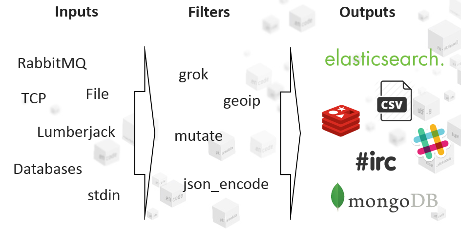

# ELK - Zapanuj Nad Logami

ELK - Elasticsearch Logstash Kibana

## Spis treści

1. [Logi](#logi)
   
  - [Czym są logi? Po co je stosujemy? Problemy z logami.](#czym-są-logi-po-co-je-stosujemy-problemy-z-logami)
  - [Poziomy logowania](#poziomy-logowania)
  - [Co o logach mówi literatura?](#co-o-logach-mówi-literatura)

2. [ELK](#elk)

  - [Elasticsearch](#elasticsearch)
    - [Terminologia](#terminologia)
    - [Full-Text Search](#full-text-search)
    - [Wyszukiwanie w indexie](#wyszukiwanie-w-indexie)
  - [Logstash](#logstash)
    - [Grok](#grok)
  - [Kibana](#kibana)
    - [Log Details](#log-details)
    - [Discover Tab](#discover-tab)
    - [Visualize Tab](#visualize-tab)
    - [Dashboard](#dashboard)

3. [Praktyka](#praktyka)

  - [ELK Server](#elk-server)
    - [Docker ELK Stack](#docker-elk-stack)
    - [Wygenerowanie certyfikatu SSL](#wygenerowanie-certyfikatu-ssl)
    - [Konfiguracja Logstash](#konfiguracja-logstash)
  - [LAMP Node](#lamp-node)
    - [Logstash Forwarder](#logstash-forwarder)

4. [ELK a skalowalność](#elk-a-skalowalność)

5. [Przydatne linki](#przydatne-linki)

## Logi

### Czym są logi? Po co je stosujemy? Problemy z logami.

> (...) zapis zawierający informację o zdarzeniach i działaniach dotyczących systemu informatycznego, systemu komputerowego czy komputera.
>
> -- *via Wikipedia*

- umożliwiają analizę działania systemu, detekcję:
   - błędów - sytuacji wyjątkowych np. logowanie informacji o wyjątku
   - nieprawidłowości działania - niezapisanie przesłanych informacji w bazie danych np. z formularza rejestracyjnego,
   - prób i sposobów włamań
- multum logów, w zależności od użytego stacku technologicznego. Prosta web aplikacja to logi z:
   - Linux Logs (Syslog, Auth Log, FTPD Log, etc.)
   - Apache,
   - PHP,
   - MySQL (slowlog, general log, error log)
   - Application Logs.
- ciężko się je przegląda (Old School way : SSH -> tail, cat, grep, less, awk ...)
- duży rozmiar, brak spójnego formatu pomiędzy logami - powodzenia przy analizie 100GB nieustrukturyzowanych logów
- należy zadbać o wprowadzenie polityki archiwizacji logów
- niepotrzebne - z punktu widzenia klienta, nie przynoszą korzyści biznesowej a jednak:
  - są...,
  - developerzy kodzą ```$log->warning('...');```
- nie przeglądamy ich - kto w ciągu ostatniego miesiąca sam z siebie rzucił okiem na logi?

Niewątpliwie logi są użytecznym narzędziem, jednak wykorzystywane powinny być z rozwagą. Dobrym pomysłem jest implementacja funkcjonalności umożliwiającej aktywowanie/deaktywowanie rejestracji zdarzeń do logów (np. tylko tych z poziomem *DEBUG*).

### Poziomy logowania

Poziomy lgowania zdefiniowane przez *Syslog* (opisane w [RFC 5424](http://tools.ietf.org/html/rfc5424)):

Level | Description | Example
------|-------------|--------
Emergency | system is unusable | *Child cannot open lock file. Exiting*
Alert | action must be taken immediately | *getpwuid: couldn't determine user name from uid*
Critical | critical conditions | *socket: Failed to get a socket, exiting child*
Error | error conditions | *Premature end of script headers*
Warning | warning conditions | *child process 1234 did not exit, sending another SIGHUP*
Notice | normal but significant condition | *httpd: caught SIGBUS, attempting to dump core in ...*
Informational | informational messages | *Server seems busy, (you may need to increase StartServers, or Min/MaxSpareServers)...*
Debug | debug-level messages | *Opening config file ...*

Wykorzysytwane między innymi przez:

- standard [PSR-3](http://www.php-fig.org/psr/psr-3/) - definiujący uniwersalny interfejs loggera dla aplikacji napisanych w języku PHP,
- serwer HTTP - [Apache 2](http://httpd.apache.org/docs/2.4/mod/core.html#loglevel).

### Co o logach mówi literatura?

> Logowanie jest Twoim przyjacielem. Aplikacje powinny logować na poziomie *WARNING* za każdym razem, kiedy przekraczany jest czas na nawiązywanie połaczenia sieciowego lub czas odpowiedzi niebezpiecznie się wydłuża. Powinieneś logować na poziomie *INFO* lub, jeśli logi są zbyt rozwlekłe, na poziomie *DEBUG* za każdym razem, gdy zamykasz połączenie. Powinieneś logować na poziomie *DEBUG* każde połączenie, które otwierasz, włączając możliwie dużo informacji na temat punktu końcowego połaczenia.
>
> -- *Ciągłe dostarczanie oprogramowania. Automatyzacja kompilacji, testowania i wdrażania. Jez Humble. David Farley. Helion 2011.*

> (...)
> - instrukcje rejestracyjne pogarszają czytelność programu, utrudniając oddzielenie jego zasadniczych instrukcji od konstrukcji pomocniczych;
> - instrukcje rejestracyjne dotknięte są tą samą przypadłością, co komentarze: gdy kod aplikacji ewoluuje, programiści zwykle zapominają o ich uaktualnieniu, co czyni je nieadekwatnymi do kontekstu, a to jest gorsze niż kompletna bezużyteczność, bo mylące;
> - niezależnie od tego, ile instrukcji rejestracyjnych znajdzie się w kodzie aplikacji, zawsze będą one niewystarczające - w przypadku kolejnego debugowania prawdopodobnie pojawią się nowe. Pozostawianie ich w kodzie sprawia, że dwa poprzednie problemy stają się jeszcze bardziej wyraźne.
>
> (...)
> Generalnie, najbardziej użytecznymi wpisami w dzienniku są te na najwyższym (strategicznym) poziomie, odzwierciedlające typowe dla aplikacji zdarzenia - jak np. logowanie do serwera HTTP. Niskopoziomowe (taktyczne) wpisy mają użyteczność raczej ograniczoną czasowo - bo np. pełnią rolę pomocną w poszukiwaniu konkretnego błędu - i celowność pozostawienia generujących je instrukcji jest co najmniej wątpliwa.
>
> -- *Debugowanie. Jak wyszukiwać i naprawiać błędy w kodzie oraz im zapobiegać. Paul Butcher. Helion 2009.*

## ELK

*Elasticsearch + Logstash + Kibana*

- trzy niezależne od siebie open-sourceowe projekty
- vendor - firma Elastic

*ELK* wspomaga proces indeksowania plików logów (ale nie tylko) w jednym miejscu. Dzięki temu możliwe jest wyszukiwanie w czasie rzeczywistym, analizowanie danych oraz przygotowywanie wizualizacji z informacji zawartych w logach. Jest szybki w dużych zbiorach danych, nawet takich zawierających gigabajty informacji.


### Elasticsearch

*Indexing, storage and retrieval engine*

- serwer bazy danych i jednocześnie silnik wyszukiwania (full-text search*)
- bazujący na *Apache Lucene*
- real-time - szybkie indexowanie danych, dostęp danych od razu
- skalowalny, rozproszony, wysoko dostępny
- komunikacja odbywa się za pomocą JSON + RESTful API (requesty HTTP - GET, POST, PUT, DELETE)
- brak określonego schematu dla składowanych dokumentów - JSON Documents

#### Terminologia

**Cluster** - grupa nodes
 
**Node** - pojedyńcza instacja *Elasticsearch*

**Index** - grupa dokumentów, powiązanych ze sobą np:

- TwitterTweets (np. per tag),
- FacebookPosts (np. per day),
- WikipediaArticles.

**Document** - odpowiednik rekordu w RDBMS, JSON ({key:value})

**Shard** - część indexu, która jest dystrybuowana pomiędzy nodami, forma kopii zapasowej (w momencie gdy któryś z node jest niedostępny)

// dodać grafikę obrazującą terminologię: https://s3.amazonaws.com/media-p.slid.es/uploads/szymontezewski/images/42225/Zrzut_ekranu_2013-07-2_o_20.47.51.png

#### Full-Text Search

- sposób przeszukiwania danych tekstowych,
- bazuje na analizie poszczególnych słów danej frazy w przeszukiwanym tekście
- zasada działania:
  - przetworzenie dokumentu tekstowego
  - utworzenie wektora słów zawartych w dokumencie
  - eliminacja stop-słów (usuwanie szumu "z, ale, od, tam")
  - lematyzacja lub stemming (sprowadzanie do podstawowej formy: samochody > samochód)
  - utworzenie indeksu FTS
- [źródło](http://kni.univ.rzeszow.pl/files/prezentacja_media_SPHINX.pdf)


#### Wyszukiwanie w indexie

```
$: curl -XGET 'http://localhost:9200/'

$: curl -XGET 'http://localhost:9200/{indexName}/_search?q={field}:{expectedValue}'

$: curl -XGET 'http://localhost:9200/logstash-2015.09.15/_search?q=response:404'
```

Przykładowa odpowiedź, z żądania */logstash-2015.09.15/_search?q=response:404*:

```json
{
   "took":8,
   "timed_out":false,
   "_shards":{
      "total":2,
      "successful":2,
      "failed":0
   },
   "hits":{
      "total":2,
      "max_score":1.0,
      "hits":[
         {
            "_index":"logstash-2015.09.15",
            "_type":"apache_access",
            "_id":"AU_PxGxlWi-k5wVY_SrA",
            "_score":1.0,
            "_source":{
               "message":"127.0.0.1 - - [15/Sep/2015:08:49:54 +0200] \"GET /lorem-ipsum HTTP/1.1\" 404 498 \"-\" \"Mozilla/5.0 (X11; Ubuntu; Linux x86_64; rv:39.0) Gecko/20100101 Firefox/39.0\"",
               "@version":"1",
               "@timestamp":"2015-09-15T06:49:54.000Z",
               "type":"apache_access",
               "file":"/var/log/apache2/access.log",
               "host":"adrian-ubuntu-vm",
               "offset":"10039",
               "clientip":"127.0.0.1",
               "ident":"-",
               "auth":"-",
               "timestamp":"15/Sep/2015:08:49:54 +0200",
               "verb":"GET",
               "request":"/lorem-ipsum",
               "httpversion":"1.1",
               "response":"404",
               "bytes":"498",
               "referrer":"\"-\"",
               "agent":"\"Mozilla/5.0 (X11; Ubuntu; Linux x86_64; rv:39.0) Gecko/20100101 Firefox/39.0\""
            }
         },
         {
            "_index":"logstash-2015.09.15",
            "_type":"apache_access",
            "_id":"AU_PxHBDWi-k5wVY_SrB",
            "_score":0.5945348,
            "_source":{
               "message":"127.0.0.1 - - [15/Sep/2015:08:50:00 +0200] \"GET /admin HTTP/1.1\" 404 493 \"-\" \"Mozilla/5.0 (X11; Ubuntu; Linux x86_64; rv:39.0) Gecko/20100101 Firefox/39.0\"",
               "@version":"1",
               "@timestamp":"2015-09-15T06:50:00.000Z",
               "type":"apache_access",
               "file":"/var/log/apache2/access.log",
               "host":"adrian-ubuntu-vm",
               "offset":"10201",
               "clientip":"127.0.0.1",
               "ident":"-",
               "auth":"-",
               "timestamp":"15/Sep/2015:08:50:00 +0200",
               "verb":"GET",
               "request":"/admin",
               "httpversion":"1.1",
               "response":"404",
               "bytes":"493",
               "referrer":"\"-\"",
               "agent":"\"Mozilla/5.0 (X11; Ubuntu; Linux x86_64; rv:39.0) Gecko/20100101 Firefox/39.0\""
            }
         }
      ]
   }
}
```

### Logstash

*Log input slicer and dicer and output writer*

- pipeline: inputs > filters > outputs
- trzy odpowiedzialności:
  - inputs - agregowanie danych z różnych źródeł
    - file, TCP, stdin, syslog, websocket, protokół Lmberjack
  - filters - parsowanie danych do postaci znormalizowanej
    - grok, mutate, geoip, json_encode
  - outputs - odsyłanie przetworzonych danych
    - elasticsearch, redis, mongoDB, irc, slack, file - csv
    


### Grok

- text matcher - umożliwia parsowanie tekstu w celu wyodrębnienia interesujących nas danych
- przetwarzanie nieustrukturyzowanych danych do ustrukturyzowanego formatu
- około 120 gotowych wzorców umożliwiających wyodrębnianie:
  - daty, czasu
  - url, host,
  - uuid,
  - log levelu
  - itd. [zobacz więcej](https://github.com/elastic/logstash/tree/v1.4.2/patterns)
- możemy definiować własne wzorce

Dostępny jest debugger online dla Groka: [grokdebug.herokuapp.com](http://grokdebug.herokuapp.com)

Przykład 1:

```
Input:

  81.112.56.18 GET /page?id=contact 1337

Pattern:
  
  %{IP:client} %{WORD:method} %{URIPATHPARAM:request} %{NUMBER:bytes}

Result:

 client  : 81.112.56.18
 method  : GET
 request : /page?id=contact
 bytes   : 1337

```

Przykład 2:

```
Input:

  2015-09-28 15:19:45 81.51.21.55 /var/app/src/Plugins.php 43 ERROR "Can't initialize plug-ins directory"

Pattern:

  %{GREEDYDATA:date} %{IP:ip} %{PATH:file} %{NUMBER:line} %{LOGLEVEL:level} %{QUOTEDSTRING:message}

Result:

 date    : 2015-09-28 15:19:45
 ip      : 81.51.21.55
 file    : /var/app/src/Plugins.php
 line    : 43
 level   : ERROR
 message : Can't initialize plug-ins directory

```

### Kibana

*Data Displayer*

- aplikacja webowa umożliwiająca wizualizację informacji zawartych w logach (przetworzonych poprzez filtry Logstash)
- intuicyjny interfejs - nawet dla osób nie technicznych
- umożliwia filtrowanie i wyszukiwanie danych
- dostęp do nowych danych w Real-Time
- możliwość generowania wykresów, list na podstawie danych - przy użyciu prostego kreatora
- pulpity - zawierające widgety - wyrkresy, listy - łatwy sposób edycji (przeciągnij opuść, rozszerz)

#### Log Details


#### Discover Tab


#### Visualize Tab


#### Dashboard


## Praktyka

Opis dotyczy uruchomienia serwera *ELK* oraz konfiguracji serwerów aplikacyjnych (*Nodes*) które za pomocą *Logstash Forwarder* będą przekazywać logi do serwera *ELK*. Przedstawione w oparciu o system Linux Ubuntu 14.04 LTS.


ELK Server - Logstash + Elasticsearch + Kibana

Nodes:

  - Application Node
  - Database Node

### ELK Server

Predefined requirements dla serwera *ELK*:

- Git Client
- Docker & Docker Compose

#### Docker ELK Stack

Najprostrzym sposobem na rozpoczęcie przygody z *ELK Stack* jest uruchomienie gotowego kontenera ([Docker-Elk](https://github.com/deviantony/docker-elk)):

```
$: git clone git@github.com:deviantony/docker-elk.git
$: cd docker-elk
$: docker-compose up -d
```

Po prawidłowym uruchomieniu na przedstawionych portach zostają uruchomione następujące usługi:

- *5000*: Logstash TCP input
- *9200*: Elasticsearch HTTP
- *5601*: Kibana Web Interface

Teraz wystarczy tylko otworzyć adres [http://localhost:5061](http://localhost:5061) w przeglądarce aby uzyskać dostęp do interfejsu Kibana.

#### Wygenerowanie certyfikatu SSL

Rekomendowana lokalizacja plików:

- certificates (.crt): ```/etc/pki/tls/certs/```
- keys (.key): ```/etc/pki/tls/private/```

Wygenerowane certyfikaty będą potrzebne dla *Logstash* (pliki .crt oraz .key) i *Logstash Forwarder* (tylko plik .crt).

##### Localhost

W przypadku kombinacji *ELK* server jako kontener Dockera + logstash-forwarder na tym samym hoście (localhost), wygenerowanie certyfikatu odbywa się za pomocą polecenia:

```
$: cd /etc/pki/tls/
$: openssl req -x509 -newkey rsa:2048 -keyout private/logstash-forwarder.key -out certs/logstash-forwarder.crt -nodes -days 3650
```

Ważne aby następujące dane uzupełnić w następujący sposób:

```
Common name: localhost
Email address: root@localhost
```

Następnie trzeba zamapować lokalizację certyfikatów. Przed uruchomieniem ```docker-compose up``` należy zmodyfikować odrobinę plik *docker-compose.yml*:

```
logstash:
  (...)
  volumes:
    - /etc/pki/tls:/etc/pki/tls  # tę linijkę należy dopisać
    - ./logstash/config:/etc/logstash/conf.d
```

Rozwiązanie zaczerpnięte z: https://github.com/cityindex-attic/logsearch/wiki/Lumberjack-Locally)

##### Other host

Na serwerze *ELK*, należy wygenerować certyfikat:

```
$: cd /etc/pki/tls/

$: openssl req -x509 -batch -nodes -newkey rsa:2048  -days 365 -keyout private/logstash-forwarder.key -out certs/logstash-forwarder.crt

$: openssl req -x509  -batch -nodes -newkey rsa:2048 -days 365 -keyout private/logstash-forwarder.key -out certs/logstash-forwarder.crt -subj /CN=logstash.example.com
```

Następnie plik *logstash-forwarder.crt* będzie także wykorzystywany na *Linux Node*. Najlepiej niech znajduje się w takiej samej lokalizacji. Korzystać będzie z niego *logastash-forwarder*.

#### Konfiguracja Logstash

```
input {
  lumberjack {
    port => 5000
    ssl_certificate => "/etc/pki/tls/certs/logstash-forwarder.crt"
    ssl_key => "/etc/pki/tls/private/logstash-forwarder.key"
  }
}

filter {
  if [type] == "my-syslog" {
    grok {
      match => {"message" => "%{SYSLOGBASE}"}
    }
  }

  if [type] == "my-apache" {
    grok {
      match => {"message" => "%{COMBINEDAPACHELOG}"}
    }
  }
  
  if [type] == "my-app" {
    grok {
      match => {"message" =>
        "%{GREEDYDATA:data} %{IP:ip} %{PATH:file} %{NUMBER:line} %{LOGLEVEL:level} %{QUOTEDSTRING:message}"
      }
    }
  }
}

output {
  elasticsearch {
    host => "localhost"
    port => "9200"
  }
}
```

### Nodes

Serwer aplikacyjny powinien posiadać zainstalowaną, skonfigurowaną oraz uruchomioną usługę *Logstash Forwarder*.

#### Logstash Forwarder

@todo Instalacja

Przykład konfiguracji:

```
$: sudo vi /etc/logstash-forwarder.conf
```

```json
{
  "network": {
    "servers": ["logstash.host:5000"],
    "timeout": 15,
    "ssl ca": "/etc/pki/tls/certs/logstash-forwarder.crt"
  },
  "files": [
    {
        "paths": ["/var/log/syslog", "/var/log/auth.log"],
        "fields": {"type": "my-syslog"}
    },
    {
      "paths": ["/var/log/apache2/access.log", "/var/log/apache2/error.log"],
      "fields": {"type": "my-apache"}
    },
    {
      "paths": ["/var/log/app.log"],
      "fields": {"type": "my-app"}
    }
  ]
}

```

Po zmianie konfiguracji należy zrestartować usługę.

```
$: sudo service logstash-forwarder restart
```

## ELK a skalowalność


## Przydatne linki

- [Elastic](http://elastic.co)
- [Elastic GitHub](https://github.com/elastic)
- [Grok Debug](http://grokdebug.herokuapp.com)
- [Grok Patterns](https://github.com/logstash-plugins/logstash-patterns-core/tree/master/patterns)
- [Scaling an ELK stack](http://www.slideshare.net/renzotoma39/scaling-an-elk-stack-at-bolcom-39412550)