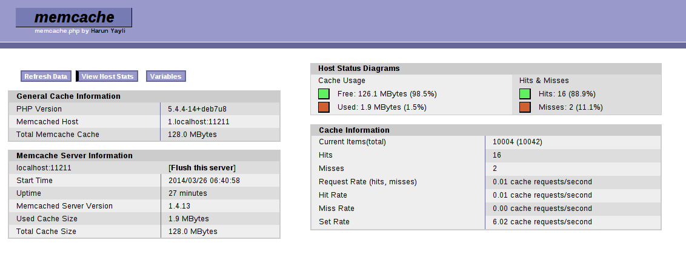
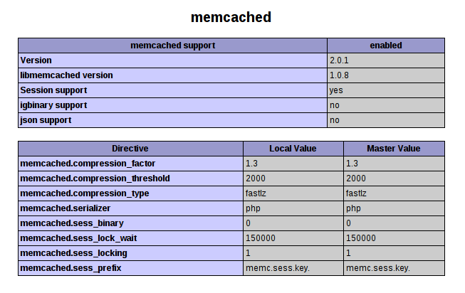

# PHP - Memcached - Buforowanie danych

Wieloplatformowy, wysoko wydajny, system buforowania danych w pamięci podręcznej.

## Memcached

Memcached to wysoko wydajny, wieloplatformowy system buforowania danych w pamięci podręcznej, opracowany przez Brada Fizpatricka w 2003 roku na potrzeby serwisu LiveJournal. Głównie wykorzystywany w celu redukcji czasu odczytu z zewnętrznych źródeł danych takich jak: bazy danych, pliki oraz web services.

Wykorzystuje model klient-serwer umożliwiając uruchomienie instancji serwera i klienta na jednej maszynie. Możemy także stworzyć architekturę kilku serwerów i klientów Memcached, w tym wypadku jednak klient musi znać wszystkie serwery. Programista odpowiedzialny jest również za implementację shardowania danych pomiędzy nimi ponieważ serwery nie komunikują się między sobą.

Szczególną uwagę należy zrócić na kwestie związane z bezpieczeństwem serwera Memcached - każdy może się do niego podłączyć na porcie 11211 TCP wykonując operację odczytu i zapisu. Dlatego bardzo częstą praktyką jest umieszczenie serwerów Memcached poza dostępem publicznym - zazwyczaj w wydzielonej sieci prywatnej.

Memcached przypomina trochę bazy noSQL przechowując dane w postaci tablicy asocjacyjnej: klucz => wartość. Klucz nie może przekraczać rozmiaru 250 bajtów a przechowywana wartość 1MB.

## Zastosowanie

Przede wszystkim Memcached nie nadaje się na miejsce do trwałego przechowywania informacji. Wszystkie dane zapisywane są w pamięci RAM, a momencie zapełnienia całego bufora, zgodnie z algorytmem LRU (Least Recently Used) usuwane są najdawniej wykorzystywane elementy. Dlatego nie możemy mieć pewności, że wcześniej zapisane dane w momencie ich kolejnego odczytu będą znajdować się w buforze. Warto dodać, że istnieje projekt [MemcacheDB](http://memcachedb.org/) bazujący na założeniach Memcached z tą różnicą, że trwale przechowuje on zapisane informacje.

Memcached posiada gotowe API dla większości popularnych języków programowania, a jego popularność w głównej mierze związana jest z optymalizacją aplikacji internetowych. Często wykorzystywany jest jako:

* miejsce na zapis sesji użytkownika - zamiast wykorzystania plików jak ma to miejsce chociażby w PHP,
* cache dla:
  * części oraz całości wygenerowanych stron,
  * wyników zapytań SQL,
  * każdego innego rodzaju danych - tj. tablice, obiekty, łańcuch znaków.
  
## Instalacja serwera Memcached dla systemu Debian

Możemy wybrać jeden z trzech dostępnych sposobów instalacji:

* z najnowszych plików źródłowych dostepnych w repozytorium GitHub - https://github.com/memcached/memcached,
* z użyciem stabilnej paczki deb dostępnej w repozytorium Debiana - https://packages.debian.org/wheezy/memcached,
* automatyzując powyższy proces instalacji za pomocą aplikacji *apt-get* - wystarczy wykonać polecenie z uprawnieniami administratora: 

```
$: sudo apt-get install memcached
```

## Uruchamianie serwera Memcached

Po prawidłowej instalacji usługa serwera Memcached jest uruchamiana automatycznie - możemy to sprawdzić wykonując polecenie:

```
$: ps -eaf | grep memcached
```

Jeżeli otrzymamy wynik zbliżony do poniższego przykładu, wszystko wskazuje na to, że serwer działa prawidłowo:

```
nobody  10255  1  0 11:55 ?  00:00:00 /usr/bin/memcached -m 64 -p 11211 -u nobody -l 127.0.0.1
```

Dla pewności zalecane jest jeszcze sprawdzenie komunikacji z Memcached. Wyświetlimy w tym celu statystyki serwera przy wykorzystaniu aplikacji:

* Netcat:

```
$: echo "stats settings" | nc localhost 11211
```

* Telnet:

```
$: telnet localhost 11211
$: stats settings
$: quit
```

Wynik który powinniśmy uzyskać:

```
$: echo "stats settings" | nc localhost 11211
STAT maxbytes 67108864
STAT maxconns 1024
STAT tcpport 11211
STAT udpport 11211
STAT inter 127.0.0.1
STAT verbosity 0
STAT oldest 0
STAT evictions on
STAT domain_socket NULL
STAT umask 700
STAT growth_factor 1.25
STAT chunk_size 48
STAT num_threads 4
STAT num_threads_per_udp 4
STAT stat_key_prefix :
STAT detail_enabled no
STAT reqs_per_event 20
STAT cas_enabled yes
STAT tcp_backlog 1024
STAT binding_protocol auto-negotiate
STAT auth_enabled_sasl no
STAT item_size_max 1048576
STAT maxconns_fast no
STAT hashpower_init 0
STAT slab_reassign no
STAT slab_automove no
END
```

Oczywiście protokół Memcached jest bardziej rozbudowany i pełną jego specyfikację znajdziesz w dokumentacji dostępnej na stronie https://github.com/memcached/memcached/blob/master/doc/protocol.txt

## Konfiguracja serwera Memcached

Cała konfiguracja związana z serwerem Memcached w przypadku systemu z rodziny Linux zapisywana jest w pliku *"/etc/memcached.conf"*. Najważniejsze opcje to:

* -d - tryb pracy jako daemon
* -v - verbose mode
* -m 64 - ilość pamięci jaką przeznaczamy na przechowywanie danych
* -p 11211 - port na którym nasłuchuje serwer
* -u nobody - uprawnienia użytkownika z jakimi uruchomi się serwer
* -l 127.0.0.1 - adres IP serwera
* -c 1024 - limit połączeń
* logfile path - plik z logami

Przykładowy plik konfiguracyjny może prezentować się w nastepujący sposób:

```
# Memcached as daemon
-d

# Log memcached's output to:
logfile /var/log/memcached.log

# Be verbose
-v

# 128 megs of RAM memory
-m 128

# Connection port is 11211
-p 11211 

# Run the daemon as nobody user
-u nobody

# Specify which IP address to listen on
-l 127.0.0.1

# Limit the number of simultaneous incoming connections
-c 2048
```

Po wprowadzonych zmianach wymagane jest zrestartowanie uruchomionej usługi:

```
$: sudo service memcached restart
```

## Monitorowanie serwera Memcached

Praca serwera Memcached może zostać poddana monitorowaniu, w tym celu powstało kilka gotowych rozwiązań różniących się od siebie funkcjonalnością oraz techonologią w której zostało ono zaimplementowane. Jednym z bardzo prostych a zarazem zapewniającym podstawowe informacje jest jednoplikowy skrypt PHP [memcache.php](http://livebookmark.net/journal/2008/05/21/memcachephp-stats-like-apcphp/). Warto dodać, że większość oprogramowania specjalizującego się w monitorowaniu serwerów takich jak Nagios oraz Munin posiada własne rozszerzenia związane z Memcached.

Konfiguracja *memcache.php* ogranicza się do modyfikacji poniższych wartości, umieszczonych bezpośrednio w jego kodzie źródłowym:

```php
// Nazwa użytkownika oraz hasło, wymagane podczas dostępu do skryptu memcache.php
define('ADMIN_USERNAME', 'memcache');
define('ADMIN_PASSWORD', 'password');

// Definicja listy serwerów Memcached
$MEMCACHE_SERVERS[] = '192.168.2.10:11211';
$MEMCACHE_SERVERS[] = '192.168.2.11:11211';
```



Pełna lista z dostępnym oprogramowaniem znajduje się pod adresem: http://code.google.com/p/memcached/wiki/MonitorLinks.

## Wykorzystanie Memcached w PHP

PHP posiada dwa wbudowane, obiektowe API umożliwiające dostęp do serwera Memcached:

* memcache - niezalecana, leciwa biblioteka,
* memcached - nowsza implementacja, wymagająca dodatkowej biblioteki *libmemcached*, dostarcza większą ilością funkcji, np:
  * plecenia APPEND/PREPEND/CAS,
  * możemy opcjonalnie wykorzystywać protokół binarny.

Memcached umożliwia przechowywanie każdego typu zmiennej, dostępnej w PHP (*array, int, string, object* itd.) za wyjątkiem zmiennych typu *resources*. W przypadku tablic i obiektów, zostaną one przechowane w postaci serializowanej. Jeżeli obiekt posiada metody magiczne *__sleep()*, *__wakeup()* to zostaną one wywołane w odpowiednich momentach.

* *__sleep()* w momencie zapisywania obiektu,
* *__wakeup()* w momencie pobierania go z bufora.

Pamiętaj, że metoda *__sleep()* musi zwracać tablicę właściwości obiektu, które zostaną zapisane w Memcached.

## Instalacja rozszerzenia Memcached dla PHP

Najprostszy sposób na instalację API Memcached dla PHP odbywa się za pomocą PECL:

```
$: sudo pecl memcached
```

Po prawidłowej instalacji, należy upewnić się, że moduł został prawidłowo włączony:

```
$: php -m | grep memcached
```

Ostatnim krokiem jest zrestartowanie usługi serwera Apache:

```
$: sudo service apache2 restart
```

Od tego momentu *phpinfo()* będzie wyświetlać dodatkową sekcję związaną z konfiguracją Memcached.



## Przykład zastosowania

### Zapis danych sesji w Memcached

Domyślnie informacje o sesji zapisywane są w postaci plików na serwerze, powoduje to dodatkowe obciążenie dla dysku ponieważ przy każdym przychodzącym żądaniu od użytkownika dane te muszą zostać ponownie wczytane. Oczywiście wdrożenie Memcached jako miejsca na przechowywanie danych sesyjnych nie będzie odczuwalne gdy stronę odwiedza zaledwie kilku użytkowników na raz. Ma to sens dopiero przy wzmożonym ruchu - wtedy przewaga wdrożenia Memcached nad domyślnym sposobem zapisu sesji staje się znacznie większa.
Problem pojawia się także gdy posiadamy więcej niż jeden serwer na którym działa kopia naszej aplikacji. W standardowym przypadku każdy z nich osobno przechowuje dane sesyjne. Wdrożenie Memcached może wyeliminować ten problem, tworząc jeden centralny punkt dla składowania tych informacji.

W przypadku PHP wystarczy zmiana dwóch dyrektyw w konfiguracji aby dane sesyjne zostały przechowywane na serwerze Memcached:

```
session.save_handler = "memcache"
session.save_path = 'tcp://localhost:11211"
```

### Przechowywanie obiektów w Memcached

Przygotujemy najpierw prostą klasę Person składającą się z trzech prywatnych właściwości *firstname*, *surname*, *age*, konstruktora oraz metod *__sleep()* i *__wakeup()*.

```php
class Person {
  private $firstname;
  private $surname;
  private $age;
  private $available;

  public function __construct($firstname, $surname, $age, $available) {
    $this->firstname = $firstname;
    $this->surname = $surname;
    $this->age = $age;
    $this->available = $available;
  }

  public function __sleep() {
    echo 'Sleep instance of person';
    return array('firstname', 'surname', 'age');
  }

  public function __wakeup() {
    echo 'Wakeup instance of person';
  }
}
```

Zauważmy, że metoda *__sleep()* zraca tylko nazwy właściwości klasy z pominięciem *available*. Podczas zapisywania obiektu klasy *Person* w Memcached, zostaną przechowane wartości tylko dla właściwości *firstname*, *surname* oraz *age*.

```php
$person = new Person('Peter', 'Smith', 30, TRUE);

$memcached = new Memcached();
$memcached->addServer('localhost', 11211);
```

Kolejną czynnością jest utworzenie obiektu klasy *Person* oraz *Memcached* a następnie zdefiniowanie adresu IP oraz portu serwera Memcached.

```php
$memcached->set('person', $person);
```

Zapisujemy objekt klasy *Person*, w tym też momencie uruchamiana jest metoda *__sleep()* tego obiektu.

```php
var_dump($memcached->get('person'));
```

Pobranie wartości z Memcached odbywa się za pomocą metody *get()*, w momencie jej wywoływania zostanie uruchomiona również metoda *__wakeup()* obiektu klasy *Person*.

Wynik działania całego skryptu powinień wyglądać w następujący sposób:

```php
Sleep instance of person
Wakeup instance of person
object(Person)#3 (4) {
["firstname":"Person":private]=> string(5) "Peter"
["surname":"Person":private]=> string(5) "Smith"
["age":"Person":private]=> int(30)
["available":"Person":private]=> NULL
}
```

Jak widzimy wartość available została utracona. Za pomocą narzędzia memcache.php możemy również przeglądać dane które zostały zapisane w Memcached. Wyżej przedstawiony obiekt będzie zapisany w postaci:

```php
O:6:"Person":3:{s:17:"Personfirstname" ;s:5:"Peter";s:15:"Personsurname";s:5: "Smith";s:11:"Personage";i:30;}
```

## Podsumowanie

Memcached jest narzędziem o potężnych możliwościach. W rozbudowanych, mocno obciążonych aplikacjach internetowych byliśmy w stanie przyśpieszyć generowanie podstron o kilkanaście a nawet kilkadziesiąt procent. Dzięki zastosowaniu wielu serwerów Memcached rozmiar naszego bufora może znacznie przekraczać ilość dostępnej pamięci RAM na jednej maszynie. Dodatkowym atutem jest łatwość konfiguracji serwera Memcached, dokumentacja dostarczona przez autorów oraz proste w obsłudze API dla wielu różnych języków programowania.